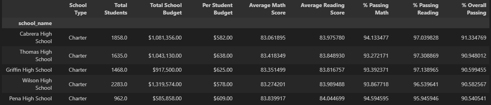
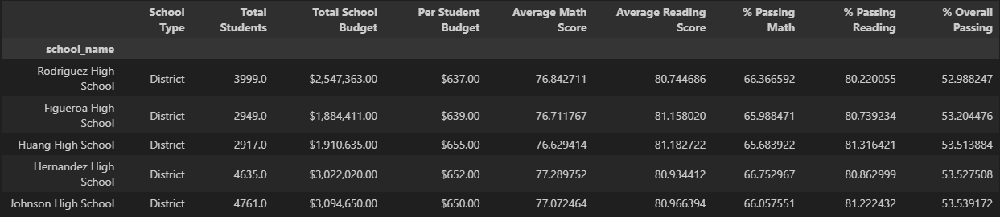
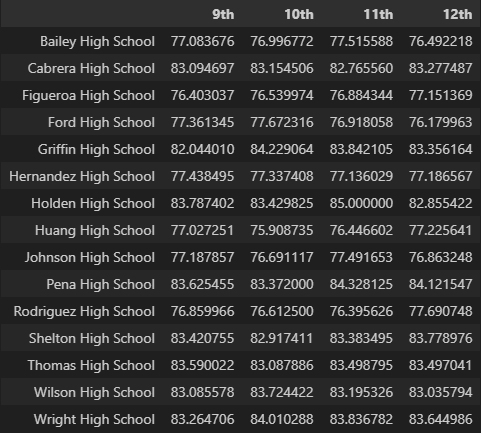
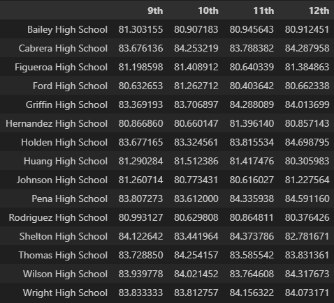
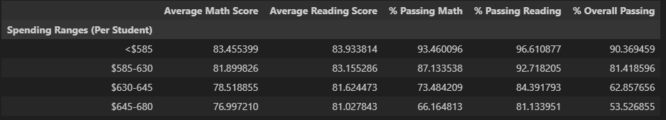
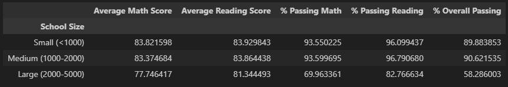
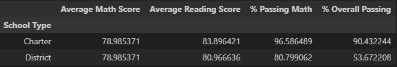

# pandas-challenge
Module 4 Challenge Assignment
## Contributor: Katy Yelle
### Overview
For this challenge there is a Jupyter Notebook script (PyCitySchools_final.ipynb) that utilizes Pandas to analyzes standardized test results of high school students in a school district.  Below is a summary of each part of the script as well as the written analysis which can also be found at the top of the Jupyter Notebook.

#### Parts 
District Summary: 
Calculates the number of schools, total number of students, district's overall budget, average math score for the district, average reading score for the district, % of students passing the math test, the % of students passing the reading test and the % of students passing both reading and math.

School Summary:
Creates a dataframe including for each school in the district the type of school, number of students, total school budget, budget per student, average math score, average reading score, % of students passing the math test, % of students passing the reading test and the % of students passing both reading and math. 

Highest Performing Schools:
Creates a dataframe of the 5 schools with the highest % of students passing both reading and math. 

Lowest Performing Schools:
Creates a data from of the 5 schoosl with the lowest % of students passing both reading and math. 

Math Scores by Grade:
Creates a dataframe for each school with the average math score by grade level (9th, 10th, 11th, 12th).

Reading Scores by Grade:
Creates a dataframe for each school with the average reading score by grade level (9th, 10th, 11th, 12th).

Scores by School Spending:
Creates a dataframe grouping schools by per student budgets. 

Scores by School Size:
Creates a dataframe grouping schools by number of students. 

Scores by School Type:
Creates a dataframe grouping schools by type of school (district or charter).

#### Written Analysis
** Analysis Summary **
*District Summary*: 
Of the district's 39,170 high school students, 74.98% are passing math and 85.81% are passing reading.  However, only 65.17% are passing in both math and reading.

*School Summary*:
In the 15 high schools, school sizes ranged from 427-4976 students (with an average of 2611) and per student budgets ranging from $578-$655 (with an average of $620).  The percent of students passing in math ranged from 65.68%-91.33% (average 80.99%), and the percent of students passing in reading ranged from 79.3%-97.3% (average 89.22%).  The percent of students passing overall by school ranged from 52.99-91.33% (average 73.28%).

*Highest Performing Schools*:
The highest performing schools based on overall % of students passing both tests were all Charter schools with number of students ranging from 962-2283 (average 1641 students). The percent of students passing math ranged from 93.27%-94.59%, and the percent of students passing reading ranged from 95.95%-97.31%.

*Lowest Performing Schools*:
The lowest performing schools based on overall % of students passing both tests were all District schools with number of students ranging from 2917-4761 (average 3852 students). The percent of students passing math ranged from 65.68%-66.75%, and the percent of students passing reading ranged from 80.44%-81.32%.

*Math Scores by Grade*:
When looking at the average math score in each grade every school's average score is above passing (70%) for every grade level (with average grade level scores ranging from 75.9 to 85 across grades and schools) Within each school grade level average scores are not vary more than 1-2 percentage points. 

*Reading Scores by Grade*:
When looking at the average math score in each grade every school's average score is above passing (70%), with the lowest average score at least 80%. Within each school grade level average scores are not vary more than 1-2 percentage points.

*Scores by School Spending*:
As schools spend more per student the % of students passing both tests decreases.  With the schools in the lowest spending group having an overall passing rate of 90.36% and the highest spending group having an overall passing rate of 53.52%.  For all groups % of students passing math was lower than % of students passing reading with the differences between the two subjects increases across school spending.  

*Scores by School Size*:
Small and medium sized schools had comparable overall passing rates (89.88% and 90.62%).  However, larger schools had much lower overall passing rate (58.28%).  Additionally, larger schools had much fewer students passing math than reading (69.96% math, 82.77% reading)

*Scores by School Type*:
Charter schools have a higher overall passing rate (90.43%) compared to district schools (53.67%).

** Conclusions **
1. Schools with lower overall passing rates have much lower passing rates in math compared to their passing rates in reading. In order to improve our overall passing rate math needs to be made a priority.

2. Charter schools (which tend to have fewer students and less per student budgets than district schools) tend to have higher % of students passing math than district schools, and therefore have a higher % of students passing overall.  As a district we should dig deeper and collect more data to see what exactly is leading to these better results.  There are a lot of factors that could be impacting this difference that we don't know with the current data.  For example, because charter schools receive less funding per student do students not have electives like in the larger district schools and instead are they spending more time in math classes?  Or with smaller total number of students are charter schools able to offer smaller class sizes for math?  Or is there a difference between math curriculums used?  Would a smaller district school have similar results as a charter school (currently all district schools are categorized as large, while charter schools are either small or medium)?
